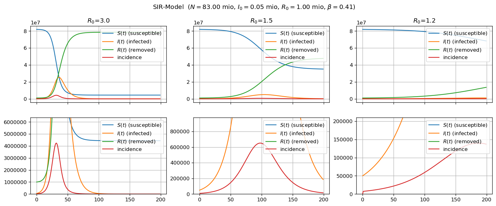
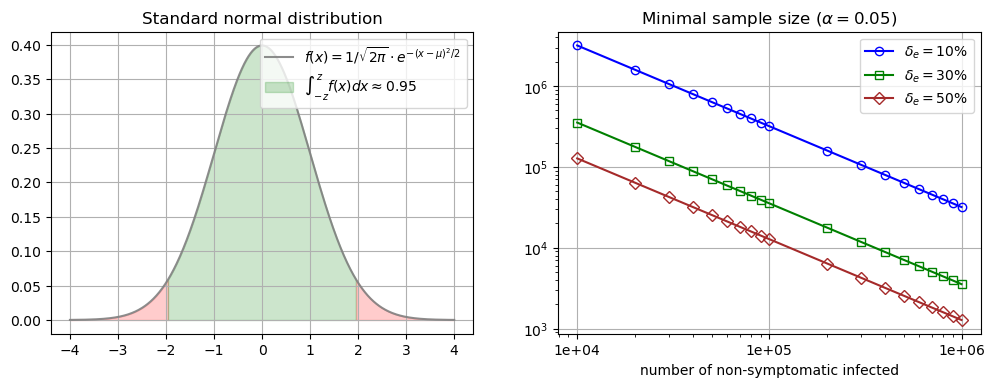
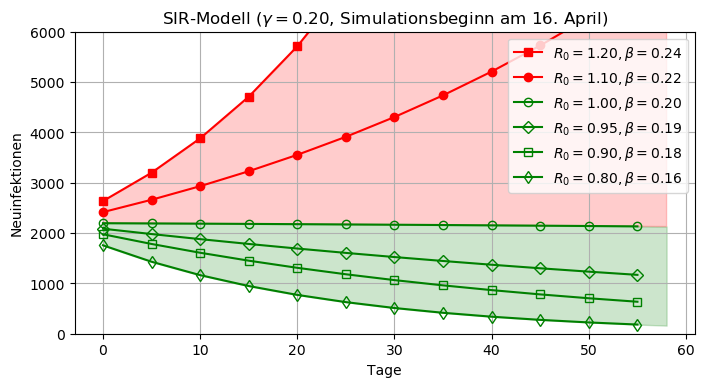

# Models for Spread of Infectious Disease

**TOC**

* [Sir-Model](#sir-model)
   * [German Language Version](#german-language-version)
   * [English Language Version](#english-language-version)
* [Sampling of Non-symptomatic COVID-19 Cases](#sampling-of-non-symptomatic-covid-19-cases)
* [Estimating Future Development of COVID-19 in DE](#estimating-future-development-of-covid-19-in-de) 

## SIR-Model

A [SIR-Model](https://en.wikipedia.org/wiki/Compartmental_models_in_epidemiology#The_SIR_model) (susceptibal -
infectious - recovered) is a simple system of three ordinary differential euqations (ODGs) which describe the
dynamics of an infectious desease. The Jupyter notebooks contain a self-containing motivation of the
SIR ODGs together with Python simulations using Euler's method for numerically solving the ODGs. Simulations are
parametrized on COVID-19.

### English Language Version

Last significant change has been made in August 2020.

* [GitHub](notebooks/sir-en-v0.3.ipynb)
* [Nbviewer](https://nbviewer.jupyter.org/github/olaf-beh/SIR/blob/master/notebooks/sir-en-v0.3.ipynb)

### German Language Version

Last significant change has been made in April 2020.

* [GitHub](notebooks/sir.ipynb)
* [Nbviewer](https://nbviewer.jupyter.org/github/olaf-beh/SIR/blob/master/notebooks/sir.ipynb)

## Sampling of Non-symptomatic COVID-19 Cases

* [GitHub](notebooks/random-test-for-infected.ipynb)
* [Nbviewer](https://nbviewer.jupyter.org/github/olaf-beh/SIR/blob/master/notebooks/random-test-for-infected.ipynb)

## Estimating Future Development of COVID-19 in DE

Some SIR scenario simulations for Germany in late April 2020. Currently in **German language only**!
 

* [GitHub](notebooks/sir-analysis-20200425.ipynb)
* [Nbviewer](https://nbviewer.jupyter.org/github/olaf-beh/SIR/blob/master/notebooks/sir-analysis-20200425.ipynb)

